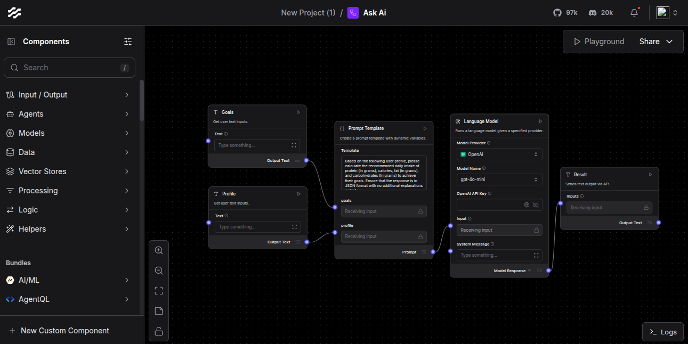

# ask-ai-langflow-agent
Here is how chatGPT and other similar applications internally works. user type something then this input converted as a prompt and send to LLM, the LLM process the prompt and send best suitable requiested information to back to use. so simple 

# My Langflow AI Agent

This is my AI agent built with Langflow.

